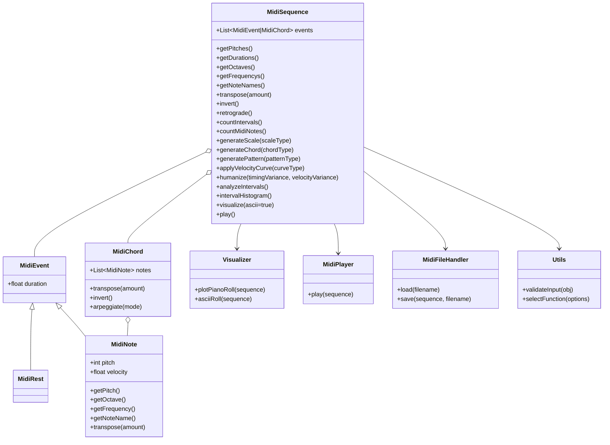

- Midi-Toolbox
	- MidiNote
	- MidiRest
	- Sequence (bisher ohne Ton-Überlappungen)
		- Oktave
		- Notennamen
		- transponieren
		- Umkehrung
		- Krebs
		- Analyse
			- Intervalle zählen
			- Noten zählen
			- histogramme der intervalle
			- rhythmische Dichte
		- generate scale
		- generate chord
		- pattern generatoren (z.b. euclidean rhythms)
		- velocity curves
		- arpeggiate
		- "humanisierung"
			- random micro-timing
			- random velocity fluctuation
	- Abspielen
		- mtof <->
	- MidiDateien
	- visualisierung 
		- ascii-piano roll oder matplotlib
- utility Funktionen
	- input (Überprüfungsmöglichkeiten)
	- Funktionen auswählen

- Assoziation
	- Composition
	- Aggregation
